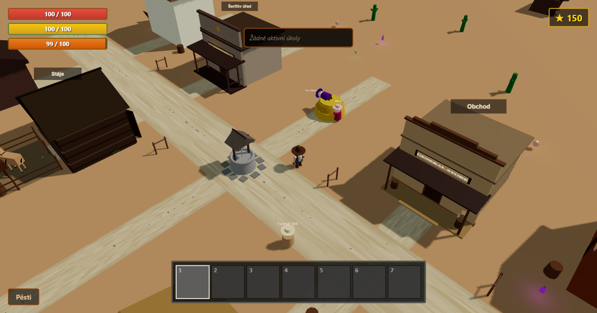

# Wild West — 3D westernová hra v prohlížeči

**▶ Hrát zdarma: [austy246.github.io/wild-west](https://austy246.github.io/wild-west/)**

Česká 3D westernová hra, kterou hraješ přímo v prohlížeči. Nic se neinstaluje,
nikam se nepřihlašuješ — otevřeš odkaz a hraješ. Funguje na počítači i na mobilu.



## Co ve hře je

- **Městečko na Divokém západě** — saloon, obchod, kovárna, stáje, kostel, hotel
  a šerifův úřad, do všech se dá vejít
- **Příběh na několik kapitol** — od kouzelné travičky pana Wazovského přes
  podzemní varnu pod kostelem až po noc, kdy se celé město schová do sklepa
- **Úkoly** od obyvatel: doručování, sbírání, nákup zásob před setměním
- **Koně** ke koupi ve stájích, a jeden jednorožec pro ty, co ho najdou
- **Den a noc** — v noci se dohled scvrkne na světlo kolem tebe a lidé jdou spát
- **Hlad a vytrvalost** — když ti dojde jídlo, obrazovku olemuje krev a už jen
  chodíš
- **Multiplayer až pro 3 hráče** — hostitel dostane šestimístný kód, ostatní ho
  napíšou a hrajete ve stejném městě
- **Hudba a zvuky** skládané přímo v prohlížeči, jiné ve dne a jiné v noci

## Ovládání

| Klávesa | Co dělá |
|---|---|
| `W` `A` `S` `D` | pohyb |
| `Shift` | běh (dokud máš vytrvalost a nemáš hlad) |
| `E` | interakce — dveře, koně, sbírání, mluvení |
| `1`–`7` | výběr z inventáře |
| levé tlačítko | útok |
| `T` | chat (v multiplayeru ho uvidí ostatní) |
| `M` | vypnout a zapnout hudbu |
| `Esc` | pauza |

## Jak to je udělané

Postavené na [Three.js](https://threejs.org/) (grafika), [cannon-es](https://pmndrs.github.io/cannon-es/)
(fyzika) a [PeerJS](https://peerjs.com/) (multiplayer napřímo mezi prohlížeči),
v TypeScriptu a Vite. Žádný herní server — celá hra běží u tebe v prohlížeči a
je hostovaná jako statické stránky na GitHub Pages.

## Spuštění lokálně

```bash
npm install
npm run dev
```

## Vlastní hudba

Hudba se standardně skládá přímo v prohlížeči. Když chceš svoji, vlož soubory
`day.mp3` a `night.mp3` do `public/audio/music/` — hra si jich všimne sama.
Používej jen hudbu, na kterou máš práva.
